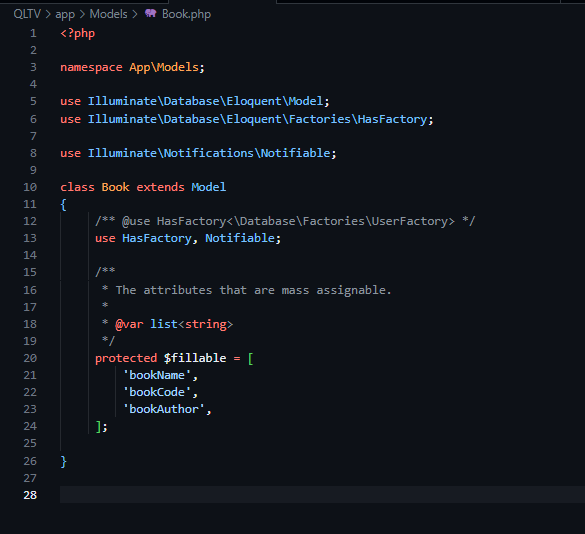

# 📚 Hệ Thống Quản Lý Thư Viện

Dự án này là một hệ thống quản lý thư viện được xây dựng dựa trên framework PHP Laravel, tuân thủ các yêu cầu về chức năng và bảo mật đã được học. Hệ thống giúp quản lý sách, độc giả và các giao dịch mượn/trả sách một cách hiệu quả.

---

## 🙋‍♀️ Thông Tin Sinh Viên

* **Họ và tên:** Phạm Thị Phương Anh.
* **Mã Sinh Viên:** 23010706.
* **Lớp:** Thiết Kế Web nâng cao TH3.

---

## ✨ 03 Đối Tượng Chính

Dự án tập trung vào quản lý 03 đối tượng cốt lõi:

1.  **`Book` (Sách):** Đại diện cho một đầu sách trong thư viện.
    * Các thuộc tính ví dụ: `bookName`, `bookCode`, `bookAuthor`.
2.  **`User` (Độc Giả):** Đại diện cho một thành viên/độc giả của thư viện.
    * Các thuộc tính ví dụ: `name`, `id`, `email`.
3.  **`BorrowRecord` (Phiếu Mượn/Trả):** Ghi lại thông tin về việc một độc giả mượn một cuốn sách. Đây là mối quan hệ nhiều-nhiều giữa `Book` và `User`.

---

## 🚀 Tính Năng Chính

* **Xác thực & Ủy quyền (Authentication & Authorization):**
    * Sử dụng **Laravel Breeze** để cung cấp hệ thống xác thực người dùng đầy đủ.
    * Hỗ trợ chức năng **đăng ký, đăng nhập và đăng xuất** tài khoản an toàn.
    * Chỉ những người dùng đã được xác thực mới có quyền thực hiện các thao tác quản lý trong hệ thống.
    * Tính năng phân quyền cơ bản để kiểm soát quyền truy cập dựa trên vai trò người dùng (ví dụ: `user` là người quản trị hệ thống).

* **Quản lý Đối Tượng:**
    * **User:** Người quản trị hệ thống, có quyền truy cập và quản lý các chức năng.
    * **Book:** Quản lý thông tin chi tiết về sách bao gồm: `bookName`, `bookAuthor`, `bookCode`.
    * **Student:** Quản lý thông tin cá nhân của sinh viên.
    * **BorrowRecord:** Lưu trữ thông tin phiếu mượn sách, liên kết giữa `Student` và `Book`.

* **Chức Năng CRUD (Create, Read, Update, Delete):**
    * Triển khai đầy đủ các thao tác CRUD cho các đối tượng **`Book`**, **`Student`** và **`BorrowRecord`**.
    * **Quản lý Số Lượng Sách Tự Động:**
        * Khi sinh viên mượn sách (`BorrowRecord` được tạo), số lượng sách (`quantity`) sẽ tự động giảm đi.
        * Khi một phiếu mượn bị xóa (`BorrowRecord` bị xóa), số lượng sách sẽ được tự động trả lại.
        * Hệ thống kiểm tra và ngăn chặn việc mượn sách nếu số lượng sách (`quantity`) đã hết.

* **Tìm Kiếm & Lọc:**
    * Cung cấp chức năng tìm kiếm và lọc sách hiệu quả theo các tiêu chí như **tác giả** và **tên sách**.

* **Bảo Mật (Security):**
    * **CSRF Protection:** Được bảo vệ qua middleware của Laravel.
    * **XSS Protection:** Tự động với Blade Templating Engine.
    * **SQL Injection:** Được ngăn chặn hiệu quả bởi Eloquent ORM.
    * **Validation:** Toàn bộ dữ liệu đầu vào được kiểm tra và xác thực nghiêm ngặt.
    * **Session & Cookies:** Sử dụng session và cookies an toàn.

* **Cơ Sở Dữ Liệu:**
    * Dữ liệu được lưu trữ trên MySQL Cloud thông qua **Aiven.io**.
    * Sử dụng file `.env` để cấu hình thông tin kết nối.

---

## 🛠️ Công Nghệ Sử Dụng

* **Backend Framework:** Laravel (PHP)
* **Database:** MySQL (triển khai trên Cloud thông qua Aiven)
* **Frontend:** Blade Templates (Laravel), HTML, CSS, JavaScript
* **Công cụ khác:** Composer, npm
---

## 💻Một Số Code Minh Họa

# 📦Model

* **User Model**

